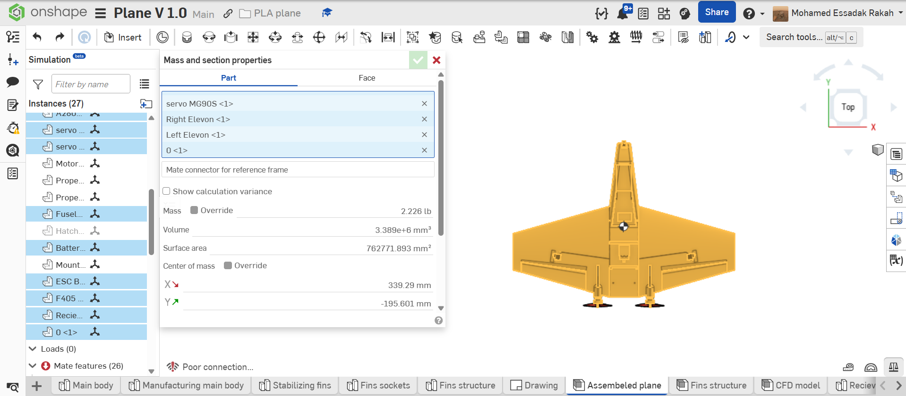

# AWRAS 1.0

**A 3D-printed, modular fixed-wing UAV platform.**


<p align="center">
  
</p>

---

## Where this sits

AWRAS 1.0 was meant to fly. It never got built — the fuselage wasn't big enough for the electronics, so the design was revised and that revision became 1.1.

What's left here is the design and all the analysis behind it, and that still stands for the whole series.

The built airframes have their own repos: **[AWRAS 1.1](https://github.com/morakah-hub/AWRAS-1.1)** and **[AWRAS 1.2](https://github.com/morakah-hub/AWRAS-1.2)**.

**[1.1](https://github.com/morakah-hub/AWRAS-1.1)** was printed and wired in Qatar and was ready to fly, but it never did — it came together too late, and flying it would have needed clearance I couldn't get before I left. The airframe stayed in Qatar; the electronics came back with me.

**[1.2](https://github.com/morakah-hub/AWRAS-1.2)** is the current aircraft, reprinted here with the lower fuselage half in PLA Pro. It's the one that will actually fly. More on each in its own repo.

The geometry changes between 1.0, 1.1 and 1.2 are small, so the airfoil study, the MAC and CG work, and the performance estimates carry over. They haven't been re-run for the later versions. That may happen later — right now the priority is getting one in the air.

---

## Why LW-PLA?

Lightweight foaming PLA expands during printing, producing parts at roughly half the density of standard PLA — light enough for a flying airframe while still printable on a consumer machine. Any damaged section can be reprinted in hours for pennies, which changes how you approach flight testing.

---

## Design at a Glance

<p align="center">
  
  
</p>

| Parameter | Value |
|---|---|
| Configuration | Tailless tapered delta (flying wing) |
| Wingspan | ~850 mm |
| Airfoil | MH60 (full span, single incidence) |
| Reference area | 219,160 mm² |
| Mean aerodynamic chord (MAC) | 275.19 mm |
| Wing aerodynamic centre | 245.51 mm |
| First-flight CG range | 273–287 mm, measured aft of the nose tip along the aircraft centreline |
| Control surfaces | Elevons only |
| Stabilizers | Dual fixed vertical fins (yaw stability + prop protection on belly landings) |
| Propulsion | 2× A2807 1700 KV brushless, rear-mounted |
| Propellers | 5″ and 7″ — both sizes to be flight-tested |
| Battery | 6S 3000 mAh 45C LiPo (throttle limited to 70% — pack is over-spec for the motors) |
| Flight controller | SpeedyBee F405 Wing |
| Radio link | ExpressLRS (ELRS) |
| Primary structure | Lightweight foaming PLA (LW-PLA) + carbon-fiber spars |
| Launch method | Hand launch |

---

## Aerodynamic & Performance Analysis

Interactive reports published via GitHub Pages:

### [2D Aerodynamic Report — MH60 Airfoil (XFOIL)](https://morakah-hub.github.io/AWRAS-1.0/Calculations/2D_Aerodynamic_analysis_%28XFOIL%29.html)

XFOIL 6.99 polar study of the MH60 section at **Re = 200k, 300k, and 400k** (Mach 0, Ncrit 9), covering the hand-launch, cruise, and high-speed flight regimes.

| Metric | Value |
|---|---|
| Peak L/D @ Re 200k | 61.9 (α = 6.5°) |
| Peak L/D @ Re 300k | 70.8 (α = 6.0°) |
| Peak L/D @ Re 400k | 77.7 (α = 6.0°) |
| CLmax @ Re 400k | 1.22 (α = 12°) |

### [Wing MAC & Aerodynamic Centre Analysis](https://morakah-hub.github.io/AWRAS-1.0/Calculations/mac_analysis.html)

MAC derivation, aerodynamic centre location, and the first-flight CG envelope. With no horizontal tail, CG placement relative to the wing AC is the most safety-critical number for first flight.

<p align="center">
  
</p>

*CG location verified in CAD using Onshape mass properties, checked against the calculated 273–287 mm envelope.*

### [Thrust & Performance Estimation](https://morakah-hub.github.io/AWRAS-1.0/Calculations/performance_analysis.html)

Predicted flight envelope for the ~1.2 kg aircraft: static thrust and thrust-to-weight for both the 5″ and 7″ propellers at the 70% throttle limit, plus estimated stall, launch, cruise, and maximum level speeds — each with the estimation method documented.

---

## Airframe & CAD

The airframe is modeled for additive manufacturing, with the internal layout organized around a modular electronics bay.

<p align="center">
  
</p>

*The airframe splits into printable sections joined by carbon-fiber spars, so damaged components can be reprinted and replaced individually.*

<p align="center">
  
</p>

*Internal volume reserved for the flight controller, ESCs, 6S battery, and future companion computing hardware.*

Full engineering drawing: [`CAD/Drawing.pdf`](CAD/Drawing.pdf)

---

## Avionics

| Component | Model | Role |
|---|---|---|
| Flight controller | SpeedyBee F405 Wing | Stabilization, elevon mixer, OSD |
| ESC | 45A 4-in-1 | Drives both motors, provides 5V BEC to the FC |
| Motors | 2× Anoel A2807 1700 KV | Twin rear pushers — throttle capped at 70% (6S is over-spec for these motors) |
| Battery | 6S 3000 mAh 45C LiPo | Main power bus |
| RC link | SuperP 14CH ELRS RX + Radiomaster Pocket TX | 2.4 GHz ExpressLRS, CRSF to the FC |
| Servos | 2× MG90S metal gear | Left/right elevons |
| FPV | RunCam Phoenix 2 SP → F405 OSD → Eachine TX805 5.8 GHz | Piloting view with telemetry overlay |

---

## Status

| Milestone | Status |
|---|---|
| Concept & configuration selection | ✅ Complete |
| CAD design | ✅ Complete |
| 2D aerodynamic analysis (XFOIL) | ✅ Complete |
| MAC / CG / stability calculations | ✅ Complete |
| LW-PLA print calibration | ✅ Complete |
| Thrust & performance estimation | ✅ Complete |
| Wiring diagram & power budget | 🔜 Planned |
| 3D CFD analysis | 🔜 Planned |

Manufacturing, assembly, and flight testing are tracked in [AWRAS 1.1](https://github.com/morakah-hub/AWRAS-1.1) and [AWRAS 1.2](https://github.com/morakah-hub/AWRAS-1.2).

---

## Repository Structure

```
AWRAS-1.0/
├── CAD/                  Airframe model, engineering drawing, rendered views
├── Calculations/         XFOIL 2D analysis + MAC/CG reports (GitHub Pages)
└── README.md
```

---

Designed by **Mohamed-Essadak Rakah** — Mechanical Engineering @ UMass Amherst
[mrakah@umass.edu](mailto:mrakah@umass.edu) · [GitHub Profile](https://github.com/morakah-hub)
